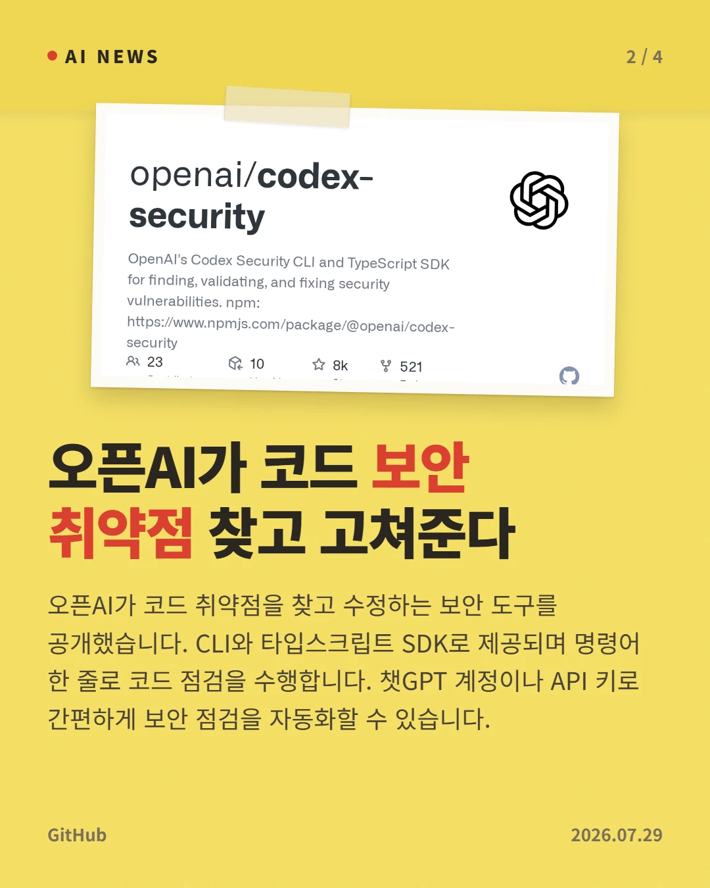
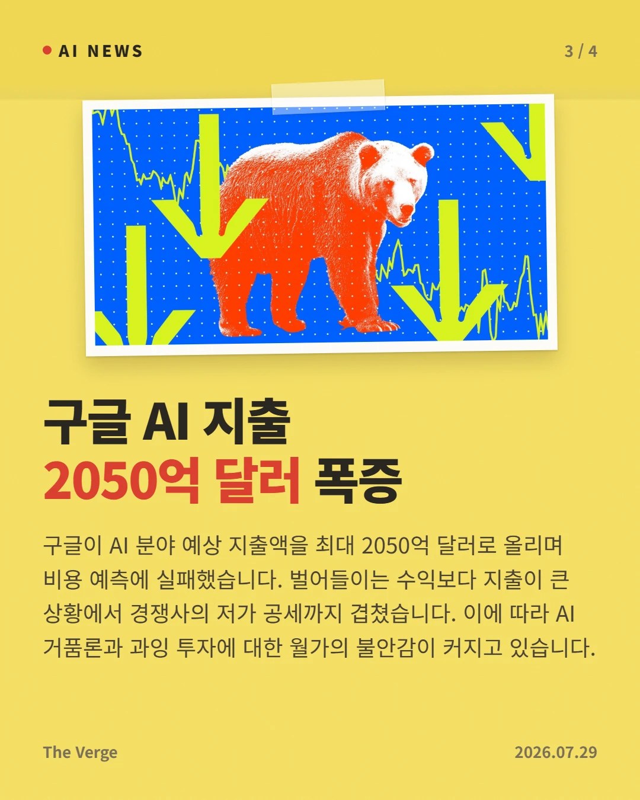

# AI-cards-news

> 매일 21:00 KST · 수집부터 게시까지 **사람 손이 개입하지 않는** AI 뉴스 카드 파이프라인

<p>
  
  
  
</p>

<sub>2026-07-29 발행분 · 전체 아카이브 → <b><a href="https://minky5004.github.io/ai-cards-news/">사이트</a></b></sub>

## 파이프라인

| 단계 | 하는 일 | 산출물 |
| --- | --- | --- |
| `ingest` | 수집 · 주제 필터 · 클러스터링 · 스코어링 | `raw.json` |
| `extract` | 원문 본문 · og:image | `articles.json` |
| `copy` | Gemini 카피라이팅 | `cards.json` `usage.json` |
| `render` | 헤드리스 Chromium 촬영 | `cards/NN.webp` |
| `deploy` | `workflow_call` 로 직접 호출 | GitHub Pages |

단계 사이의 경계는 파일뿐 — 독립 실행·테스트·교체가 되고, 파이프라인(Java)과 웹(Astro)의 언어가 달라도 이음매가 없다.

- **주제 필터** — 약어는 대소문자 + 양쪽 경계. 느슨하면 AirPods 가 통과한다
- **본문 추출** — 대표 기사가 스크래핑을 막으면 같은 클러스터의 다른 매체로 폴백
- **배포 호출** — `GITHUB_TOKEN` 푸시는 워크플로를 발화시키지 못한다(재귀 방지)

## 설계 판단

값은 전부 `config/pipeline.yaml` 에 있다. **왜 그 값인지**가 여기 있다.

| 값 | 왜 그 값인가 |
| --- | --- |
| 같은 사건 판정 `2 · 0.5 · 0.2` | 54건 정답 세트에 격자 탐색 |
| 스코어 가중치 `mentions` 최고 | 여러 매체 동시 보도 = 화제성의 가장 직접적 증거 |
| 하루 카드 `5장` · 최소 `2.5점` | 기사 1건 = 호출 1회 = 무료 한도 5회 |
| 발행 예약 `12:00 UTC` | 한도 리셋(Pacific 자정) 이후 |
| 완료 판정 = **파일 존재** | 상태 저장소 없이 재시도 |
| `content/` 를 리포에 커밋 | 아카이브 보존 · 정적 빌드 입력 |

- 유사도 하나로는 안 갈린다 — `Gemini 3.6 Flash` 는 자카드로 어디에도 닿지 못한다. 그래서 공유 내용어 하한 + overlap(짧은 제목) OR 자카드(긴 제목)
- 재실행은 실패한 단계부터 이어서 돈다. 끝난 날짜에는 Gemini 를 0회 부른다
- 한도 누적(`usage.json`)이 리포에 있어야 러너의 새 체크아웃을 넘어 살아남는다

**감수한 것**

- 클러스터마다 무관 기사 1건씩 딸려온다 — 조이면 오염은 0 이나 OpenAI·Hugging Face 3건이 흩어진다
- 예약이 2시간쯤 늦게 발화한다(3일 관측) — 그날 안에만 나가면 되므로 방치
- 파일이 있는데 **내용이 깨진 경우**는 못 잡는다

## 검증

| 무엇을 | 어떻게 |
| --- | --- |
| 클러스터 임계값 | 07-22 수집분 54건에 손으로 정답을 붙여 격자 탐색 |
| 무인 종단 완주 | 2회 관측 — run `30459911527` · `30550181481` |
| 테스트 84개 | 코드를 일부러 깨뜨려 **실패하는지** 확인 |
| 웹 | 가짜 날짜를 깔아 월 경계 발화 |

- 채택값뿐 아니라 **기각한 값**(자카드 `0.3` · `0.15`)의 결과도 `config/pipeline.yaml` 주석에 남겼다
- 한때 카피 넘침 감지가 어떤 입력에도 0 을 반환했다 — 항상 0 인 지표는 통과했다는 착각만 준다
- 발행일이 적어 목록 자르기도 월 경계도 실제로는 발화하지 않는다

## 구조

| 경로 | 역할 |
| --- | --- |
| `pipeline/` | 수집·스코어링·카피·렌더링 Java CLI |
| `web/` | 카드를 보여주는 정적 사이트 (Astro) |
| `config/` | 소스 목록 · 스코어 가중치 등 튜닝 대상 |
| `prompts/` | LLM 프롬프트 — 카피 톤은 코드가 아니라 여기서 튜닝 |
| `templates/` | 카드 HTML/CSS — 생김새는 코드가 아니라 여기서 변경 |
| `assets/` | 카드에 심어 보내는 폰트 |
| `content/` | 날짜별 산출물 — 완성된 날짜만 커밋 |

## 개발

JDK 25 필요 · Gradle 은 wrapper 커밋됨.

```bash
./gradlew run --args="config"                          # 설정 먼저 검증
./gradlew run --args="ingest  --date 2026-07-30"       # --date 생략 시 KST 오늘
./gradlew run --args="extract --date 2026-07-30"
./gradlew run --args="copy    --date 2026-07-30"
./gradlew run --args="render  --date 2026-07-30"
```

- 각 단계는 앞 단계 산출물을 읽음 · 이미 만든 산출물은 `--force` 없이 안 덮어씀
- 카드 생김새는 `templates/card.html` 만 고치면 바뀜 · 한글 폰트는 러너에 없어 `assets/fonts/` 를 심어 보냄
- 카피에는 `GEMINI_API_KEY` 필요 — 로컬은 `.env`, 자동화는 같은 이름의 환경변수

### 웹

```bash
cd web && pnpm install
pnpm dev      # http://localhost:4321/ai-cards-news/
pnpm build    # dist/ 에 정적 사이트
```

- **카드 JSON 과 렌더 이미지가 모두 갖춰진 날짜만** 실림 — 깨진 이미지는 아카이브에 영구히 남으므로
- `scripts/sync-cards.mjs` 가 빌드 앞에서 `public/cards/` 로 복사 (Astro 정적 자산 경로가 거기뿐)

## 기술 스택

Java 25 · Gradle · Astro · Playwright · Gemini API · GitHub Actions · GitHub Pages
