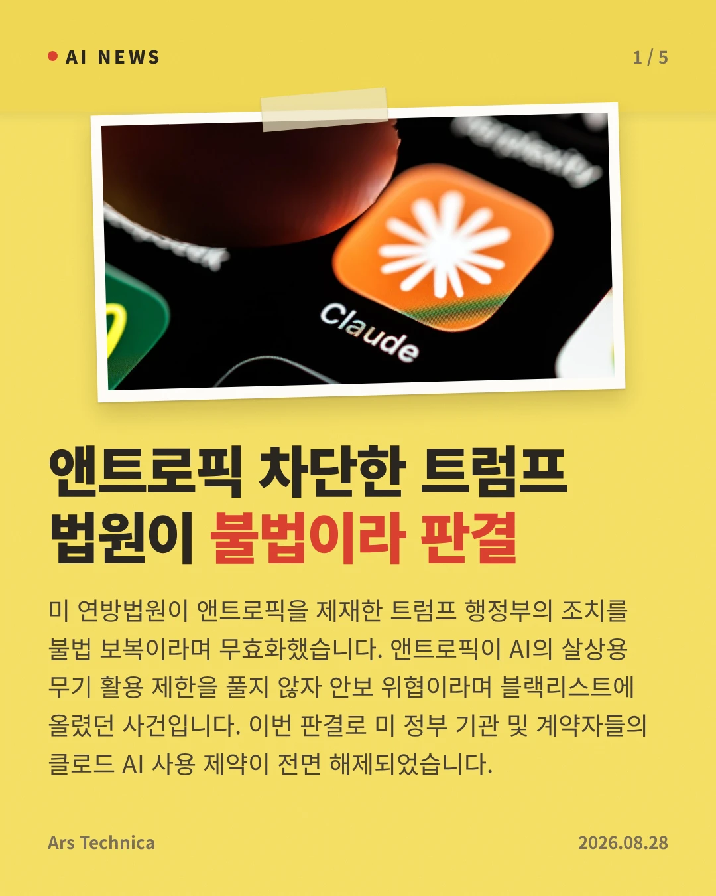
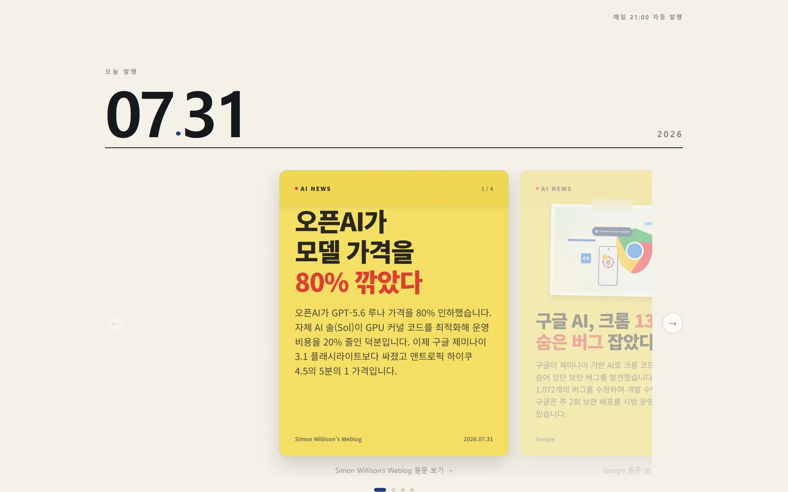
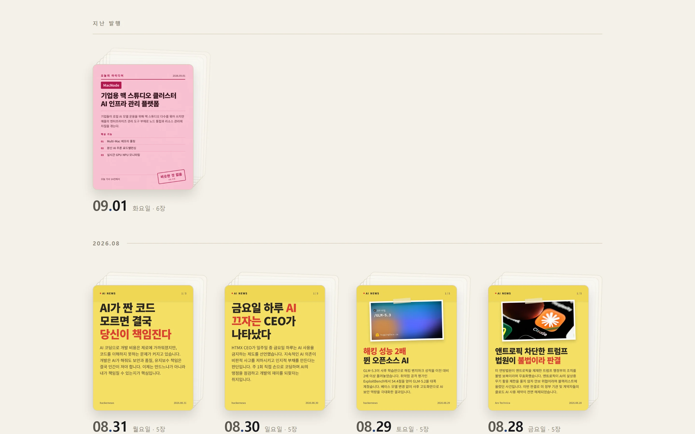
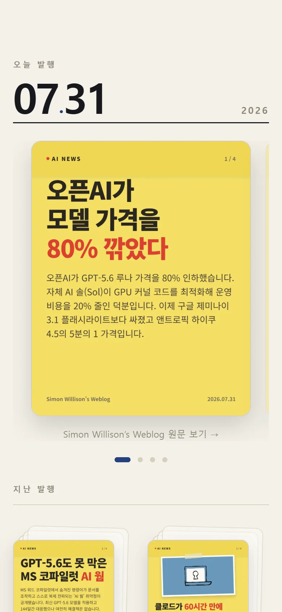

# AI-cards-news

> 매일 밤 · 수집부터 게시까지 **사람 손이 개입하지 않는** AI 뉴스 카드 파이프라인

<p>
  
  
  
</p>

<sub>2026-08-28 발행분 · 2026-07-26 이후 전량 → <b><a href="https://minky5004.github.io/ai-cards-news/">사이트</a></b></sub>

<p>
  
  
  
</p>

<sub>같은 카드를 싣는 정적 사이트 · 쌓인 날짜가 곧 아카이브 · 캐러셀·확대·전환 전부 라이브러리 없이 CSS 와 스크립트로</sub>

## 파이프라인

| 단계 | 하는 일 | 산출물 |
| --- | --- | --- |
| `ingest` | 수집 · 주제 필터 · 클러스터링 · 스코어링 | `raw.json` |
| `extract` | 원문 본문 · og:image | `articles.json` |
| `copy` | Gemini 카피라이팅 | `cards.json` `usage.json` |
| `idea` | 그날 기사에서 사업 아이디어 1건 · HN 검색 중복 판정 | `ideas.json` |
| `render` | 헤드리스 Chromium 촬영 | `cards/NN.webp` `idea.webp` |
| `deploy` | `workflow_call` 로 직접 호출 | GitHub Pages |

단계 사이의 경계는 파일뿐 — 독립 실행·테스트·교체 가능 · 파이프라인(Java)과 웹(Astro)의 언어가 달라도 이음매 없는 구조.

- **주제 필터** — 약어는 대소문자 + 양쪽 경계. 느슨하면 AirPods 통과
- **본문 추출** — 대표 기사의 스크래핑 차단 시 같은 클러스터의 다른 매체로 폴백
- **배포 호출** — `GITHUB_TOKEN` 푸시의 워크플로 미발화(재귀 방지) · 호출부가 발행 커밋 SHA 전달로 그 사이 다른 푸시와 무관한 그날 카드 게시
- **아이디어 카드는 덱 첫 장** — 아카이브 더미 표지도 같은 장 · 실패해도 카드 다섯 장이 나가는 곁가지 · 산출물은 `cards/` 밖 `idea.webp`(그 디렉터리의 `.webp` 수를 `cards.json` 장수와 견주는 웹)

## 설계 판단

값은 전부 `config/pipeline.yaml` 에. **왜 그 값인지**가 여기.

| 값 | 왜 그 값인가 |
| --- | --- |
| 같은 사건 판정 `2 · 0.5 · 0.2` | 54건 정답 세트에 격자 탐색 |
| 스코어 가중치 `mentions` 최고 | 여러 매체 동시 보도 = 화제성의 가장 직접적 증거 |
| 하루 카드 `5장` · 최소 `2.5점` | 기사 1건 = 호출 1회 · 아이디어 1회를 더해 6/20회 |
| 발행 예약 `12:00 UTC` | 한도 리셋(Pacific 자정) 이후 |
| 완료 판정 = **파일 존재** | 상태 저장소 없이 재시도 |
| `content/` 를 리포에 커밋 | 아카이브 보존 · 정적 빌드 입력 |

- 유사도 하나로는 분간 불가 — `Gemini 3.6 Flash` 는 자카드로 어디에도 미달. 그래서 공유 내용어 하한 + overlap(짧은 제목) OR 자카드(긴 제목)
- 재실행은 실패한 단계부터 이어서 · 끝난 날짜에는 Gemini 0회 — 아이디어가 빠진 채 끝난 날만 1회
- 한도 누적(`usage.json`)의 리포 존치 — 러너의 새 체크아웃을 넘어 살아남는 유일한 자리

**감수한 것**

- 클러스터마다 무관 기사 1건씩 — 조이면 오염 0 이나 OpenAI·Hugging Face 3건 분산
- 예약 지연 발화 방치(34일 관측 · 41분~9시간 57분 · 중앙값 1시간 12분) — 예약 시각 앵커 · 24시간까지 같은 날짜
- 파일은 있는데 **내용이 깨진 경우**는 미탐지

## 검증

| 무엇을 | 어떻게 |
| --- | --- |
| 클러스터 임계값 | 07-22 수집분 54건에 손으로 정답을 붙여 격자 탐색 |
| 무인 종단 완주 | 07-28~08-30 스케줄 34회 중 31회 — 끊긴 셋은 Pages 배포 타임아웃(`31110053608`) · 기사 본문의 키 형태로 막힌 푸시(`31600410158`) · 하루 밀린 날짜 라벨(`33120448014`). 아카이브 결번 0일 |
| 테스트 222개 | 코드를 일부러 깨뜨려 **실패하는지** 확인 |
| 웹 | 실제 발행일로는 목록 자르기도 월 경계도 미발화 — 가짜 날짜를 깔아 발화 |

- 채택값뿐 아니라 **기각한 값**(자카드 `0.3` · `0.15`)의 결과도 `config/pipeline.yaml` 주석에
- 한때 카피 넘침 감지가 어떤 입력에도 0 반환 — 항상 0 인 지표는 통과했다는 착각만

## 구조

| 경로 | 역할 |
| --- | --- |
| `pipeline/` | 수집·스코어링·카피·렌더링 Java CLI |
| `web/` | 카드를 보여주는 정적 사이트 (Astro) |
| `config/` | 소스 목록 · 스코어 가중치 등 튜닝 대상 |
| `prompts/` | LLM 프롬프트 — 카피 톤은 코드가 아니라 여기서 튜닝 |
| `templates/` | 카드 HTML/CSS — 생김새는 코드가 아니라 여기서 변경 |
| `assets/` | 카드에 심어 보내는 폰트 |
| `content/` | 날짜별 산출물 — 완성된 날짜만 커밋 |
| `docs/` | 화면 스크린샷 — 헤드리스로 찍어 PR·README 에서 참조 |

## 개발

JDK 25 필요 · Gradle 은 wrapper 동봉.

```bash
./gradlew run --args="config"                          # 설정 먼저 검증
./gradlew run --args="ingest  --date 2026-07-30"       # --date 생략 시 KST 오늘
./gradlew run --args="extract --date 2026-07-30"
./gradlew run --args="copy    --date 2026-07-30"
./gradlew run --args="idea    --date 2026-07-30"
./gradlew run --args="render  --date 2026-07-30"
```

- 각 단계의 입력은 앞 단계 산출물 · `--force` 없이는 기존 산출물 보존
- 카드 생김새의 단일 출처 `templates/card.html`·`idea-card.html` · 한글 폰트는 러너에 없어 `assets/fonts/` 동봉
- 카피·아이디어에 `GEMINI_API_KEY` 필요 — 로컬은 `.env` · 자동화는 같은 이름의 환경변수

### 웹

```bash
cd web && pnpm install
pnpm dev      # http://localhost:4321/ai-cards-news/
pnpm build    # dist/ 에 정적 사이트
```

- **카드 JSON 과 렌더 이미지가 모두 갖춰진 날짜만** 게재 — 깨진 이미지의 아카이브 영구 잔존 방지
- `scripts/sync-cards.mjs` 가 빌드 앞에서 `public/cards/` 로 복사 — Astro 정적 자산 경로가 거기뿐

## 기술 스택

Java 25 · Gradle · Astro · Playwright · Gemini API · GitHub Actions · GitHub Pages
